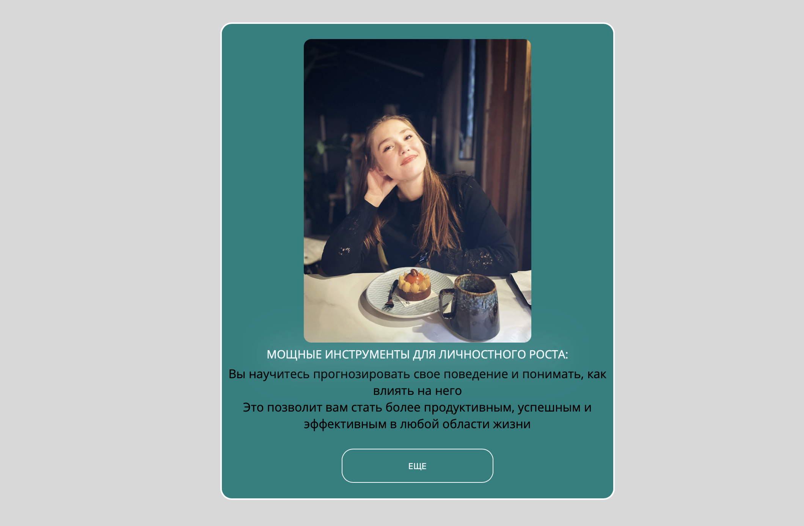
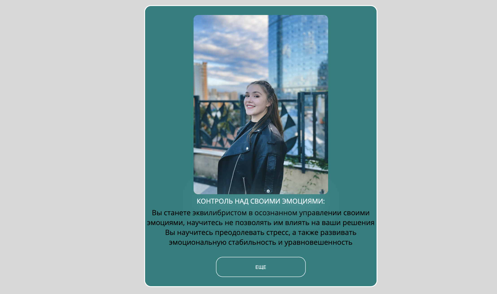
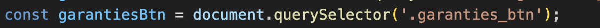

# Project Title 

**<ins>Website for psyhplogist</ins>**

## Project Description

`PROGECT CREATED ON TECHNOLOGIES`
<br>
<br>

 


*Simple Website with Java Script library, container with changing picture with click was making also on Java Script, animation with AOS and beatiful CSS style*
<br>
<br>



### How to install the project 
_______
<br>

```
cd psycologistSucota
code .
npm start
``````

## How to use the project 


Sometimes this btn in Java Script a bug to fix this problem needs update page or click few times on the button 


*If you have soluction of this problem I would like yo hear it*

<ins>Also website had X-scroll because of AOS animation. 
</ins>
````Css
body {
overflow-x: hidden;
}
``````
I resolved this problem. I used the first time AOS in this project. And did not know that problem like this can be in the project


## You can see my project 
<ins> Follow link </ins>
<br>
[project](https://anasubota.glitch.me)